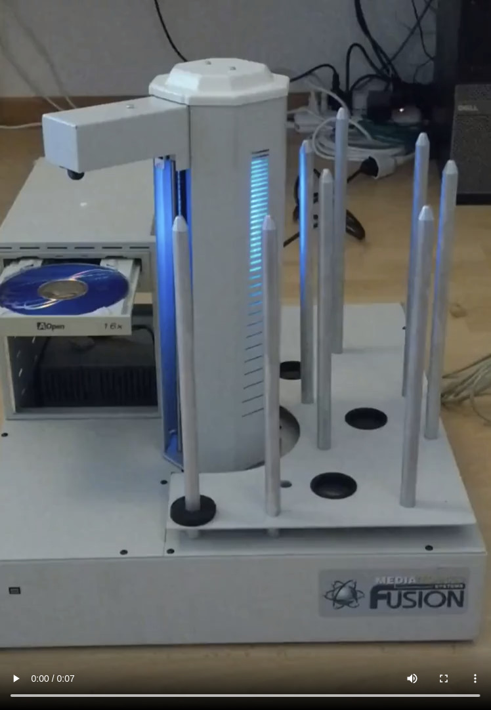
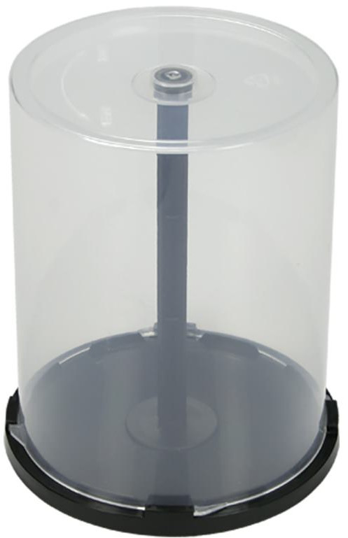
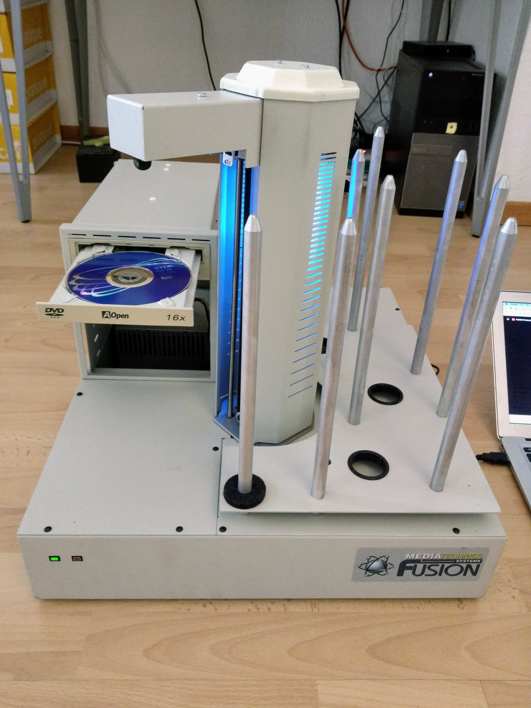
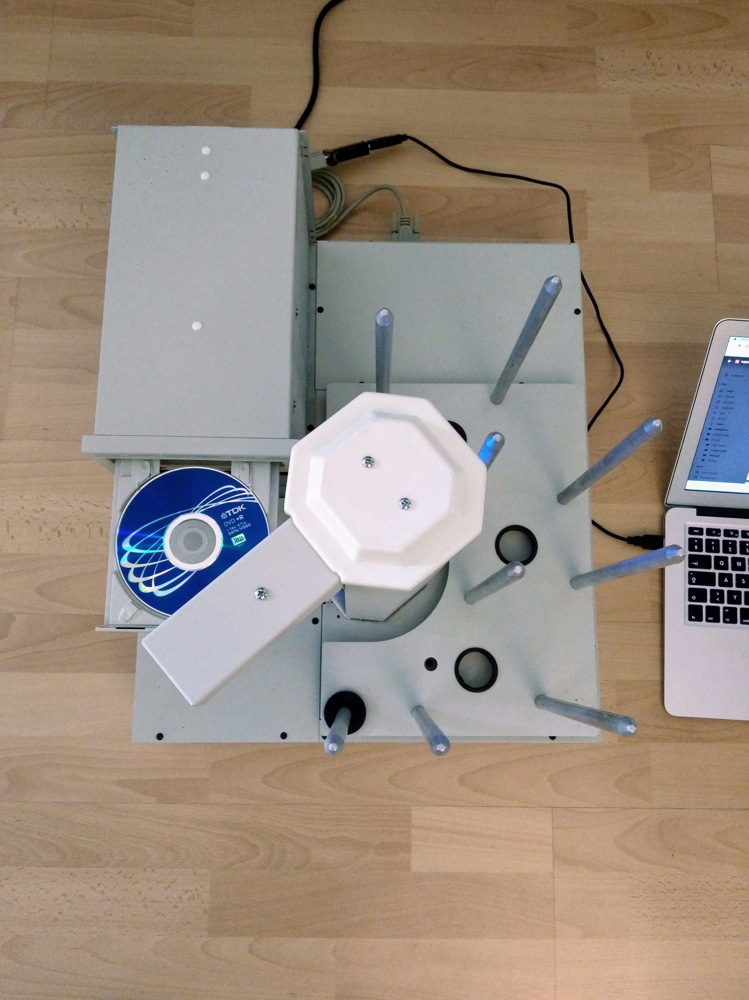

CD ripping robot
================

Back in 2004, many people still had large CD collections, which often represented a significant financial and emotional investment. Services like Spotify had yet to come into existence, yet it was becoming obvious how convenient it was to ones music available on a hard disk rather than on a huge number of individual CDs. However, ripping ones entire CD collection involved a serious time cost.

Typical commercial DVD or Blu-ray disks are produced by duplicators that essentially press the disk in a single operation. But you can also buy duplicator robots that work with writable DVDs, they take a huge input pile of such DVDs and a robot arm moves the disks from the input pile to one or more DVD writers and once written the arm moves the disks to an output pile.

I had the idea to use such a duplicator not to write disks but to take a CD collection as its input and rip it in multiple drives with the robot arm doing all the time consuming work of managing the process of moving disks between the input pile, the drives doing the ripping and the output pile.

You can see a short video of the duplicator, that I bought, in action here:

[](https://george-hawkins.github.io/project-graveyard/dvd-duplicator/videos/disk-removal.mp4)

In this video the duplicator just has one DVD player but as you can see it has space for more - four in total. The input bin of the duplicator can take 600 disks at a time. If the arm sounds like it's making more noise than it should, it is. There's a cable guide in the central tower that's not doing its job properly and a ribbon cable is scrapping against it as the arm moves up and down.

The idea was to create a service where customers would be shipped CD _cake boxes_ (or spindles), they'd do the job of taking their CDs out of their cases (referred to as [jewel cases](https://en.wikipedia.org/wiki/Optical_disc_packaging#Jewel_case)) and load them into the cake boxes that they'd then ship back.

_Cake box._  


The CDs would then be trasferred to the input bin of the repurposed DVD duplicator and it would then do the job of ripping the collection.

There were obviously all kinds of additional elements to the service, e.g.:

* Make the job of unpacking ones collection into cake boxes and reassembling it afterward.
* Optimizing the ripping process by detecting if a given disk had already been ripped for a previous customer.
* Adding metadata from a service like [CDDB](https://en.wikipedia.org/wiki/CDDB).
* Scanning the art-work and text of the front of disks (either all disks or just those for which metadata could not be retrieved).

One of the unexpected difficulties in this project was reading from multiple DVD/CD drives concurrently. This sounds like it should be a non-issue, even at top speed there's far less data to be read from such a drive than there is for a hard disk operating at full speed so it should be possible to read from four such drives without much trouble. As it turned out, it was very hard read at more than the speed of a single drive, i.e. one could only read from four drives at a quarter of the speed that one could from a single drive. If there was a single data bus and only one drive could use it at a time then this is what you'd expect. However, I bought PCI cards that were supposed provide independent buses and I have a background that means I could and did ensure that [DMA](https://en.wikipedia.org/wiki/Direct_memory_access) etc. was set up and behaving as expected. And yet, despite all this it proved surprisingly hard to get satisfactory read performance from multiple drives. In the end, the setup essentially required each drive to talk to an independent computer.

The duplicator was controlled by a fairly simple serial protocol. It was the controlling computer's job to e.g. eject a given drive's tray at the end of a ripping job and ask the duplicator to move the disk to the output bin and insert the next disk to be ripped. The duplicator was intelligent enough that you didn't have to tell it which drive's tray was open, it had enough sensors to be able to find the top most currently open tray itself (and to provide feedback via the serial interface as to what it was doing).

Note: the duplicator actually had three bins - an input bin, an output bin and a reject bin. When acting as a duplicator, the controlling computer, if it detected that something had gone wrong during the writing process, would ask the duplicator to move the resulting disk to the reject bin rather than the output bin. For the CD ripping service, the reject bin never came into play.

_Front view._


_Top view._


Destruction and more details
----------------------------

The project fizzled out for various reasons and was never offered as a commercial service to end customers. The duplicator ended up in storage for sixteen years and recently I tried to give it away but there were no takers. The weight and size of the duplicator made it difficult to do anything with it - in the end I completely dismantled it. This was an interesting process that I've documented in excessive detail [here](https://george-hawkins.github.io/project-graveyard/dvd-duplicator/). This documentation also discusses some aspects of the project that I haven't covered here.

Documentation
-------------

There wasn't much documentation to go with this device - all the information I needed to work with it (including the simple serial protocol) is in this PDF - [`FUSION-Protocol_i.pdf`](docs/FUSION-Protocol_i.pdf). I also received this HTML file - [`copypro.html`](copypro.html) - from the manufacturer but I never used any information in it (and to be honest, I suspect it _may_ be the protocol details for a completely different device).

Many of the commands documented in FUSION-Protocol_i.pdf are actually macros. The device shipped with a standard set of macros (to which you could add your own). The default set of macros can be found in [`macros.txt`](docs/macros.txt). It's interesting to see how many of the operations described in the PDF are defined and made up of calls to additional macros or to a small number of fundamental built-in operations. Each macro is introduced with `[` and its body is made up of calls to other macros (indicated by a preceeding `/`) or to built-in operations, e.g. for callibration one sends a `C` via the serial interface and it is defined like so:

```
[C
/Rp1 /Rp2 l1=0 /CE W5 /CS /VNoCD8 W5
```

So `[C` defines the macro `C` and it calls additional macros, like `Rp1`, and some built-in operations (with arguments) like `l1=0`.
