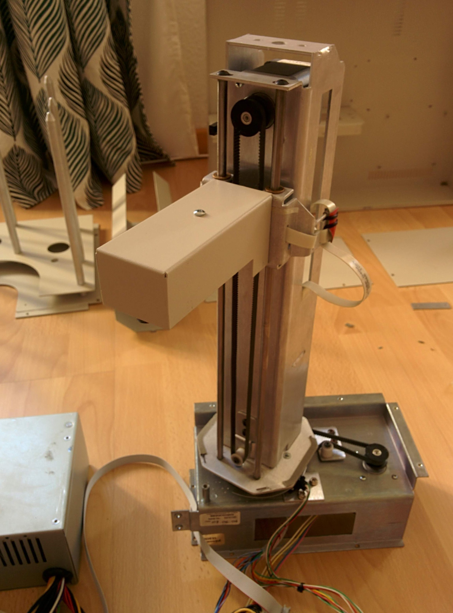
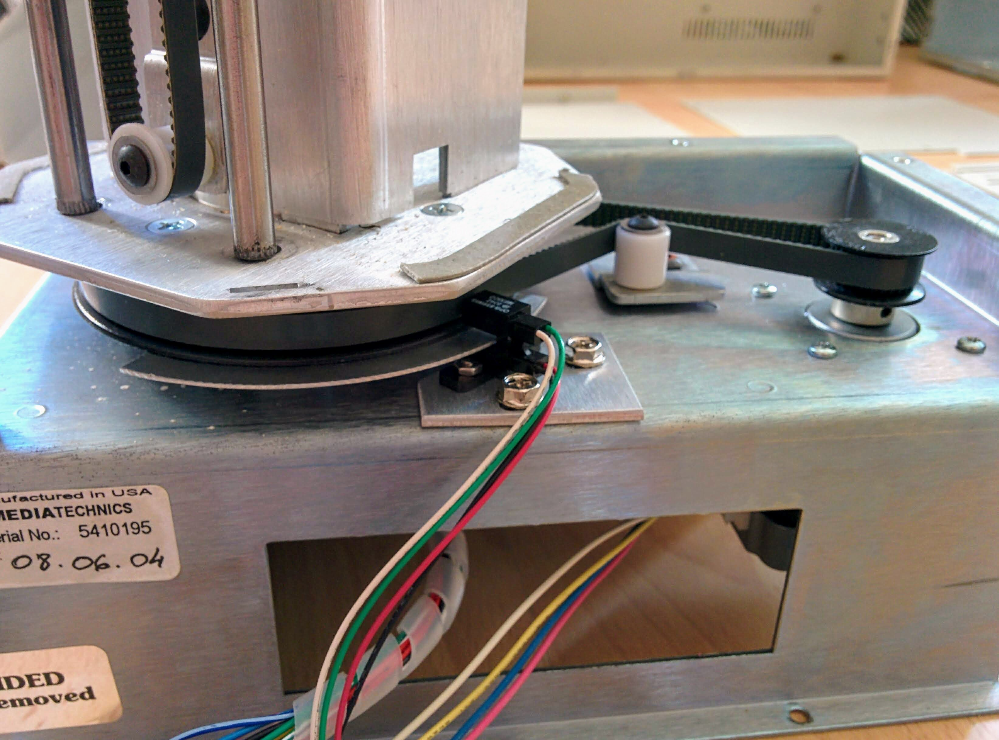
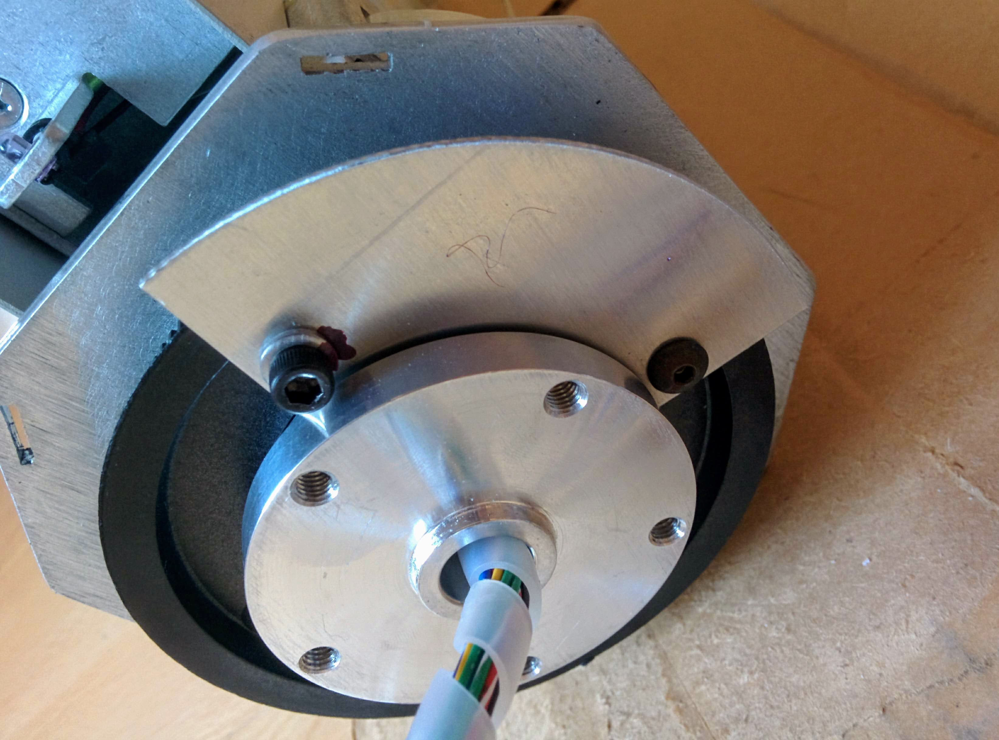
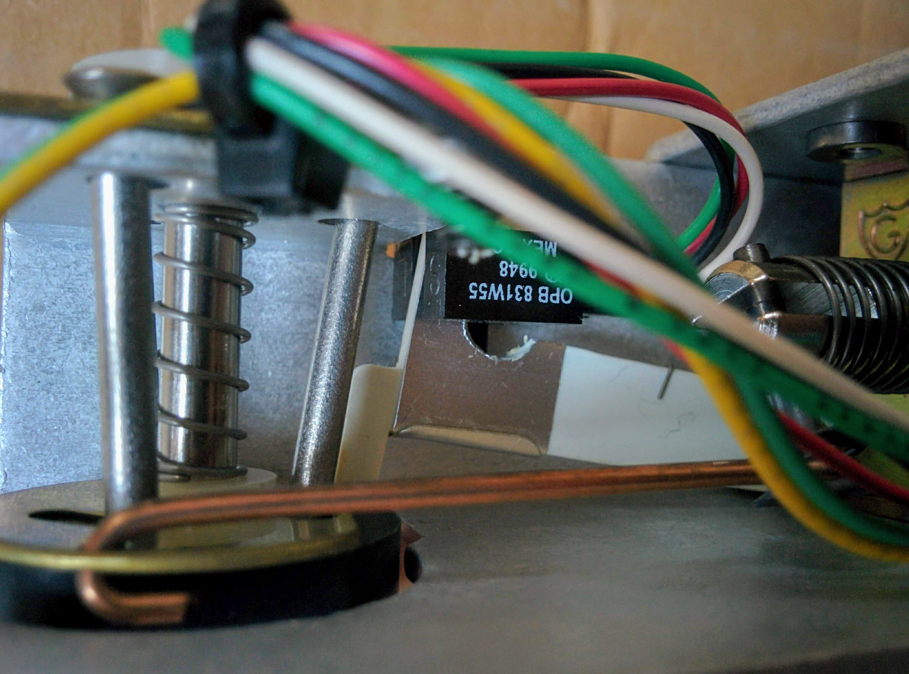
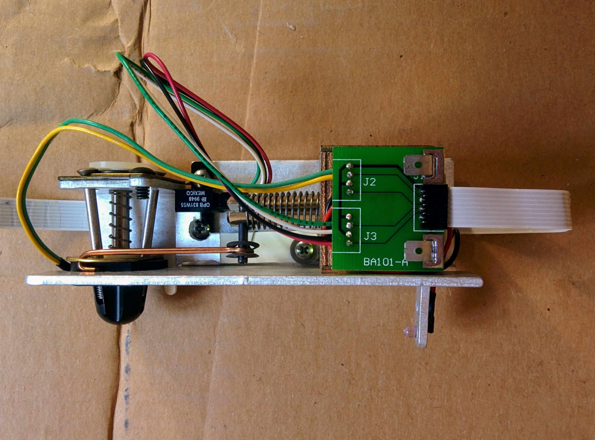
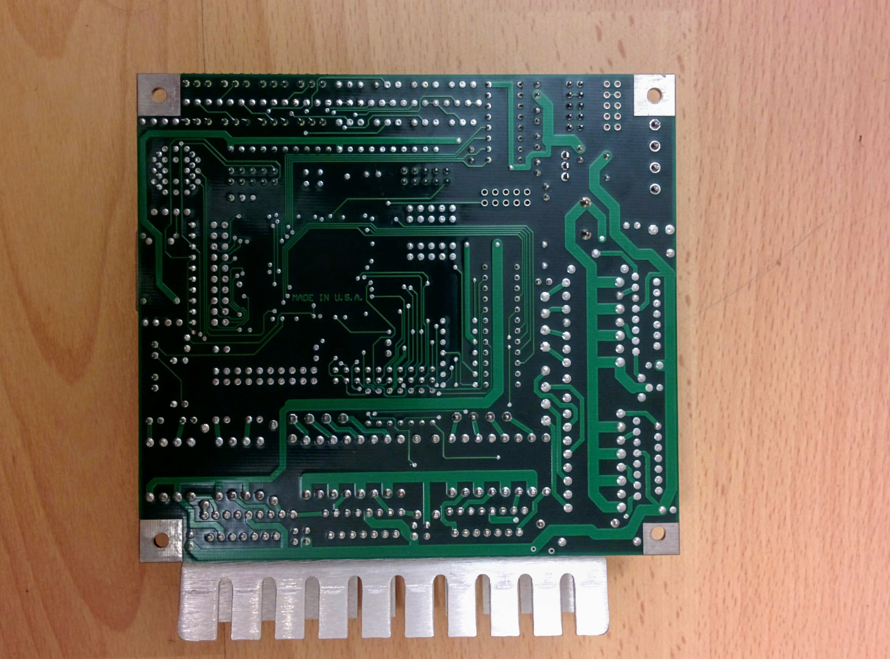
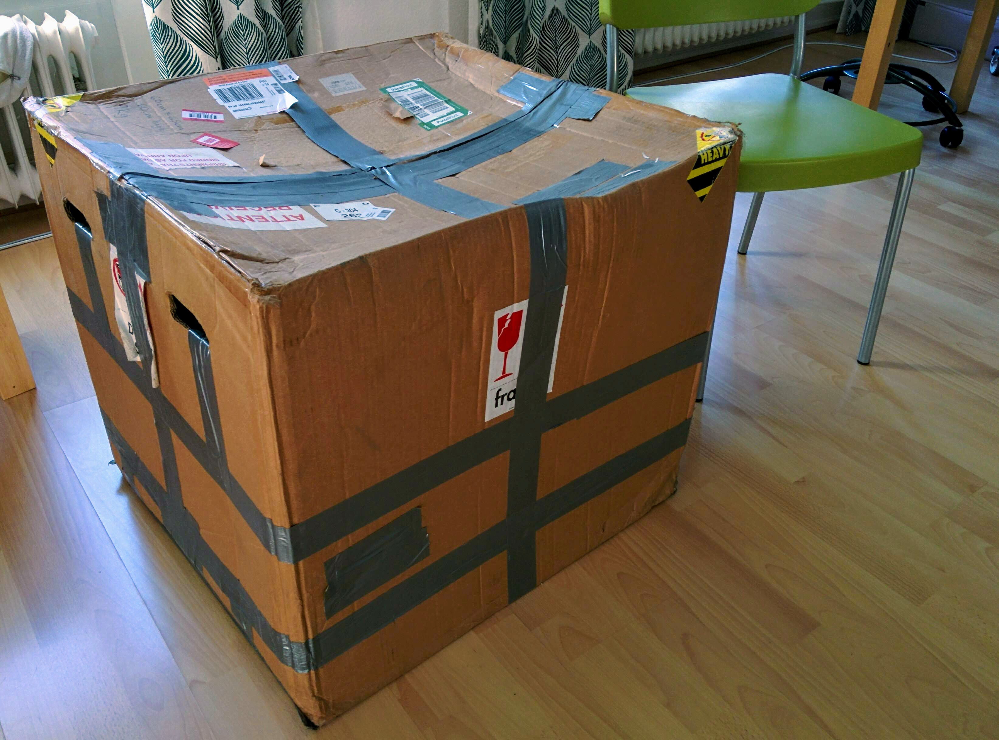

Dismantling a DVD duplicator robot
==================================

I often take things apart, but it's not often I take apart an almost unused functioning DVD duplicator robot, that cost ~US$3,000, and reduce it to about 16kg of metal, 1kg of wires and PCBs and 1kg of possibly reusable but essentially worthless parts. This page document the destruction. It's mainly photos but there are also three videos below.

On disassembling, it became clear that nearly all the value in this device is in the physical structure - it contains surprisingly little in the way of interesting electronics.

The duplicator at the start of the process:

And at the end...

_Metal._  

_More metal._  

Nearly all the structure is sheet metal that's been cut and then bent into shape with a little bit of very lightweight welding at some points. The only exception being the joint between the base and the tower, which appears to have been custom milled from aluminum.

_The power supply PCB, the duplicator PCB, wires and some small parts and supporting PCBs._  

_Potentially reusable but essentially worthless parts._  

The solenoid is still sold today for about US$17. A similar cold cathode tube and inverter can be bought for around US$10. The photo interrupters are obsolete now, their [replacement part](https://www.digikey.ch/product-detail/en/tt-electronics-optek-technology/OPB831W55Z/365-1729-ND/1637183) costs around US$4 each. The steppers are no longer produced but similar name-brand steppers cost around US$30 (and no-name steppers can be bought for a lot less). The stainless steel shafts can be bought for around US$3.50 each (e.g. [here](https://www.sparkfun.com/products/12384) on Sparkfun). As to the timing belts and pulleys, you can buy similar-ish parts from Servocity, e.g. a large plastic [timing hub](https://www.servocity.com/timing-hub-pulley/) for US$8 or a [26" timing belt](https://www.servocity.com/26-130t-3-8-wide-xl-timing/) for about US$6. And finally the fans - similar fans would cost between US$5 and US$10.

_And a lot of bolts, nuts, screws and washers._  

Still in one piece
------------------

Let's look at the duplicator in its initial state. It's a MediaTechnics Fusion4 that was bought in 2004. The Fusion 4 is still being produced [today](https://www.mediatechnics.com/pages/fusion4dvd.htm) (with a very slightly updated design - rounder edges on the case being the most obvious change). It can handle 600 disks at a time and is 69cm wide, 66cm high and 71cm deep.

_Video of duplicator removing disk (apologies for drift in camera angle)._  
<video controls preload="metadata">
    <source src="videos/disk-removal.mp4" type="video/mp4">
</video>

If it sounds like it's making more noise than it should, it is. There's a cable guide in the central tower that's not doing its job properly and a ribbon cable is scrapping against it as the arm moves up and down.

_Front._

_Right._  

_Left._  

_Back._  

_Back (base)._  

_Made with pride._  

Taking the top off the case
---------------------------

The first step was to remove most of the outer casing.

_The main PCB and the PSU (front view)._  

_The main PCB and the PSU (back view)._  

_The serial connector (and a surprising amount of empty space)._  

Removing the tower's casing
---------------------------

_Back._  

For some reason I didn't notice the casing on the arm itself. I should have taken that off too at this stage.

_Right._  

_Front._  

_Left._  

Warranty voided
---------------

Oddly, you could take apart 99% of the device before it actually became necessary to break the warranty voided sticker.

Bits and pieces
---------------

There's not too much discarded yet.

Main PCB
--------

_The main PCB._  

_The case-front LEDs._  

The PCB features three L298N motor drivers. These are high voltage, high current dual full-bridge drivers and are attached to a substantial aluminum heatsink.

Setting things up without the case
----------------------------------

_The tower, removed from the case and stood up on its own._  

_Ready to be connected to the mains and to a computer (via the serial cable)._  

_Remains of the case in the background._  

Some PSUs (mainly older ones) have an on/off switch but all PCs have a separate power switch for turning on and off the computer (generally just press to start but press and hold to shut down if the computer is up and running). This PC power switch is connected to the PSU via the motherboard. When you plug in a PSU the PC's fans and some other devices like the DVD drive generally spin up for a second before stopping again - the PSU only powers up and stays powered up if the PC power switch, mediated via the motherboard, says it should.

So if you don't have a motherboard (as in this situation), how do you keep the PSU powered up? By connecting the green PS-ON pin of the main PSU connector to one of the ground pins. So I was a bit confused by this arrangement where both the PS-ON pin and the group pin beside it _appeared_ to have been connected to a +5V pin:

However, all that had been done was to tidy things up by folding the wire connecting PS-ON and ground into a convenient socket.

_Video of duplicator in action without casing._  
<video controls preload="metadata">
    <source src="videos/arm-full-movement.mp4" type="video/mp4">
</video>

Close ups of the connectors
---------------------------

I had to unplug many of the connectors before being able to remove the tower from its base. I wanted to wire things up again afterwards, hence some close-ups of the connectors to show what should be plugged back into what.

Most of the connectors could be distinguished by the colors of the wires or other characteristics but the ones here (with red, white and green wires) had to be labeled.

Tower base details
------------------

_Timing belt._  

_Photo interrupter._  

Removing the tower
------------------

_Removed photo interrupter._  

The tower base with the stepper removed. Most of the rest of the device is fairly light, but the base of the tower is a much heavier and more substantial piece of metal.

_Removing the bolts that hold on the tower._  

The tower turns on a substantial custom milled aluminum joint. The wiring for the tower runs through the center of this joint. The joint also features a large plastic timing hub and a metal quadrant that interacts with the photo interrupter on the base to which the tower is attached.

There are sixteen wires within the spiral cable wrap. If you want to pass wires between components that rotate relative to each other, you might often use a [slip ring](https://en.wikipedia.org/wiki/Slip_ring). However, a slip ring that supported sixteen wires would be quite expensive and slip rings support continuous rotation - which isn't required here. Instead, for this application it was acceptable for the wires to be twisted back and forward through the ~225&deg; between the DVD drives and the furthest away DVD bin.

In the video below, we can see the system powering up (flashing red LED), then it successfully calibrates the tower motor (arm moves to top and breaks photo interrupter beam) but then fails to calibrate the motor from the base of the tower. It's hard to see due to the poor quality of the video but, after the arm has moved to the top of the tower successfully, the motor from the base of the tower (bottom right) starts to spin. The calibration expects this to turn the base of the tower and result in the breaking of the beam of the photo interrupter on the tower base. When this fails to happen the red LED lights up and the cold cathode tube in the tower starts to flash. You can see the tower base photo interrupter between the two pieces of cardboard (it's mounted on a triangular piece of metal) - it's possible to manually break its beam to fool the calibration, but it's quite tricky to do it in just the right manner that the system expects.

_Video of duplicator failing to calibrate._  
<video controls preload="metadata">
    <source src="videos/arm-up.mp4" type="video/mp4">
</video>

Tower close-ups - front
-----------------------

_Top of tower with timing pulley (and stepper motor)._  

_Bottom of tower with idler pulley (i.e. toothless pulley)._  

Tower close-ups - back and sides
--------------------------------

_Left-side of tower top with projection from arm almost parked in the photo interrupter._  

Ribbon cable running from a small PCB within the tower to the tower arm (held in place here with cable ties and a piece of VHB-like tape folded under and over the cable, with its double-sided coating unremoved on the outer facing section). As the arm moves up and down the tower, the ribbon cable has to bend smoothly up and down through the slot in the side of the tower without buckling. To help with this a transparent layer of thick-ish tape was applied to both sides of the ribbon cable to make is stiffer. Similar bits of tape (removed before these pictures were taken) were also taped along the long sides of the slot, such that half the tape's width was on the inside of the tower and the other half bent outwards, at right angles, through the slot to create side walls to the channel formed by the slot. However, this tape had warped with time and actually ended up impeding the movement of the ribbon rather than helping it. Nowadays, one would probably create something with a 3D printer to do this kind of job.

_Right-side of tower._  

[Cold cathode tubes](https://en.wikipedia.org/wiki/Cold_cathode) are commonly used for laptop screen backlighting, they're also popular with [PC case modders](https://en.wikipedia.org/wiki/Case_modding) for lighting mods. In this duplicator, there's one in the tower that's used as a status indicator, e.g. it flashes on and off if calibration fails.

_Back of tower with stepper and top of cold cathode tube._  

_Wiring for stepper and photo interrupter._  

There's a small PCB in the tower but all it's doing is connecting all the wires that came up through the joint at the base of the tower (and which are soldered onto the underside of the PCB) to the various components in the tower. We can see:

* The ribbon cable that runs to the arm.
* A connector with red and black wires that run down under to the inverter for the cold cathode tube (two white wire, just visible in the back right, then run back up from the inverter to the tube).
* A connector with red, blue, yellow and white wires that run up to the stepper.
* A connector with red, black, white and green wires that run up the photo interrupter.

In the background here we see the spiral cable wrap taking the wires, that have come through the tower-base joint, up to the underside of the small PCB. And in the foreground we can see the [inverter](https://en.wikipedia.org/wiki/CCFL_inverter) for the cold cathode tube.

Here, we see the tower base, which is bolted to a large aluminum joint that also features a plastic timing hub that's used to turn the tower.

Arm pickup mechanism
--------------------

On the underside of the arm is the DVD pickup head. Here we can see the threaded end of one of three bolts that form part of the head mechanism. And we can see a small white nub that's part of a lever mechanism. When the arm descends on a DVD the nub is forced upwards (and the lever breaks the beam of a photo interrupter), the bolt ends are then angled outwards causing the pickup head to grab the DVD, so it can be lifted.

Initially, I thought that the semi-transparent disk at the front of the pickup head was some kind of lens. But I couldn't think what it could be looking at. As it turns out, it's just hot-melt adhesive (as dispensed by a hot-glue gun). There's a small IR photo transistor behind the glue that's looking to detect IR light coming in via a small hole in the _back_ of the pickup head.

Here we can see the small IR LED, at the back of the arm, that generates the light detected by the photo transistor in the pickup head.

_Rear view of IR LED and cable tie._  

Here we can see the insides of the arm - a small solenoid, connected by a rod to a disk that forms part of the DVD pickup head and, in the background, a photo interrupter and lever mechanism.

If I push on the external nub of the lever, it pushes the lever up into the photo interrupter.

_Close-up of lever breaking photo interrupter beam._  

When the solenoid is powered up, it pulls the rod and turns the disk mechanism of the pickup head.

Here we can see the disk, with three slots - one for each of the bolts whose threaded ends we saw above on the external part of the pickup head. Here the rod is in its default extended position.

Here the rod has been pulled back, causing the disk to rotate - we can see that the position of the bolts has changed relative to the slots (and externally this has caused the threaded ends of the bolts to become angled outwards).

Here we can see the same from the outside, first with the bolt heads angled inwards (as they would be when letting go of a disk).

And here we can see the bolt heads angled outward (as they would be when holding a disk).

Tower internals
---------------

Once all the internals are taken out, it's clear how little there is to the tower. Going clockwise from top-left, we have:

* All the wires that came up through the joint in the base of the tower.
* The photo interrupter from the top of the tower.
* The arm.
* The stepper motor.
* The cold cathode tube and inverter.

And in the middle the small PCB that connects the top-left wires to all the other components.

The top-side of the small PCB - on the left is the connector for the ribbon cable to the tower arm, top-center is the connector for the inverter, top-right is the connector for the stepper and bottom-right is the connector for the photo interrupter (at the top of the tower).

On the underside, all the wires, that came up through the joint in the base of the tower, are soldered to the PCB.

The cold cathode tube and inverter. There's no branding on the tube or inverter but it _appears_ to be a Logisys product. Logisys is a name that's been used by various unrelated companies. This particular Logisys is a Chinese company whose website has been offline since 2017, but you can still find them on the Wayback Machine. This item appears to be their _4" Cold Cathode Light Kit with Single Tube_ - you can find the details [here](https://web.archive.org/web/20160713205848/http://logisyscomputer.com/viewsku.asp?SKUID=CLK4BL&DID=ccflkit) on the Wayback Machine.

Detached tower arm
------------------

_Arm with ribbon cable still attached._  

_Arm left side (slight rear angle)._  

_Arm left side (slight front angle)._  

_Arm top._  

_Arm front._  

Dismantled tower arm
--------------------

_The non-electrical/electronic components of the arm._  

This pull-type frame solenoid is still sold today. Guardian Electric is part of Kelco Industries and you can find the [datasheet](https://www.kelcoind.com/wp-content/uploads/PDF/DC%20Frame%20Solenoids/Model_28_DC_Frame_Solenoid.pdf) on their site (and on [Octopart](https://octopart.com/28-c-12d-guardian+electric-37884)).

I desoldered the solenoid from the small PCB (but as you can see I snipped off the slots for the solenoid tabs to make the job easier). The remaining items, attached to the PCB, are the pickup head, the photo interrupter and the IR LED.

_Connected parts and back of PCB._

_Connected parts and front of PCB._

_PCB close-up (with ribbon cable connector to the right)._  

DVD pickup head
---------------

As explained earlier, what I mistook for a lens here on the pickup head is just semi-transparent hot-melt adhesive. Either side of this non-lens, you can see the recesses that held the bolt ends (which, when angled outwards, would hold a DVD to the head).

_Pickup head from the left._  

_Pickup head parts._  

The pickup head from the underside - you can see the wires going to the photo transistor, the three holes for the bolts and a cut-out at the front that makes way for the external nub of the lever that detects if a DVD is present.

I ended up sawing off the head containing the photo transistor. It was only afterward that I realized I could fairly easily scoop out the hot-melt adhesive and could have just done that and then pulled out the photo transistor through the resulting hole. It was only at this stage that I realized that there was a small hole, that we can see here, at the back of the head that allows the photo transistor to see the light from the IR LED that was mounted on the back-most part of the arm.

_The hole that held the legs (and connected wires) of the photo transistor._

I referred to this earlier as a photo transistor - actually, it's impossible _for me_ to tell if it's a photo transistor or a photo diode - it's one or the other. In any case, it's something that can detect IR light.

Tower arm mechanics
-------------------

The layout of the tower is as show here, the stepper motor bolted in at the top (left) and an idler pulley part, with two holes, bolted on at the bottom (right):

The belt is about 670mm (the belt at the base of the tower is much shorter at about 425mm).

The arm travels up and down two steel shafts on a timing belt with a stepper at one end and an idler pulley at the other. The stepper has a timing pulley attached to its motor shaft.

The arm from behind, on the left the part to which the ribbon cable was cable tied and on the right the projection that breaks the beam of the photo interrupter at the top of the tower.

_The arm underside._  

_The arm from top-rear._  

_The attachment that holds the timing belt._  

_Arm with timing belt attachment removed (see slot with screw hole to its right)._  

_Slot and screw hole from underside._  

_Timing belt attachment - front._  

_Timing belt attachment - rear._  

_Point of contact for timing belt attachment - front._  

_Point of contact for timing belt attachment - rear._  

Base/tower joint
----------------

On the tower base, you can see a socket-cap allen bolt (it's just to the left of the bottom-left hole of the five holes for the bolts that hold on the tower/base joint). You can also see a similar bolt on the left side of the metal quadrant, it passes through the quadrant and makes up one of the four bolts that hold the timing hub to the joint. The socket-cap allen bolt on the base and the one on the joint block each other and prevent the tower from turning through more that 360&deg; relative to the base.

_Joint, belt, idler pulley part, stepper and base._  

_Joint top._  

_Joint top from side._  

_Joint base._  

_Joint base from side (here you can see the socket-cap allen bolt clearly)._  

_Joint side._  

Initially, I was sceptical that these were custom-made parts. But, if you know what you're doing, it seems _relatively_ simple to produce such things on a lathe. There are lots of videos on YouTube showing professionals and hobbyists producing similar things, e.g. this [mesmerizing video](https://youtu.be/qMrlyEreba8) by _This Old Tony_ of him producing a coffee pot.

Clockwise from top-left, we have the plastic timing hub, the photo interrupter quadrant (as you can see it's actually a quadrant with an inner quadrant removed), the top nut, the lower part of the joint (with a pipe that comes up through the center of the other half) and the upper part of the joint (with an inlaid rolling bearing).

_Lower part - bottom close-up._  

If you look very closely below, you can just make out the marking _R10Z_. This appears to be a non-metric [NSK](https://www.nsk.com/) product - the R10Z having dimensions:

* Bore diameter: 5/8" (15.9mm)
* Outer diameter: 1 3/8" (35mm)
* Thickness: 11/32" (8.7mm)

These things are called radial ball bearing, deep groove ball bearings or rolling bearings. You find similar products on [Adafruit](https://www.adafruit.com/product/1178) and [Sparkfun](https://www.sparkfun.com/products/13277).

_Upper part - bottom close-up._  

Close-up of the rolling bearing and the center tube of the upper part of the joint, at the other end of the tube, you can make out the edge of another rolling bearing.

_Upper rolling bearing._

As already noted, there's another rolling bearing in the bottom of the upper part of the joint. The pipe element of the lower part of the joint passes through the center of the upper part. If you look at lower part, you'll see a slightly raised part just around the base of the tube - this presses against the inner-half of the lower of the two rolling bearings while the nut for the top of the pipe is screwed down firmly against the inner-half of the upper rollling bearing. The rolling bearings result in the two parts turning _extremely_ smoothly relative to each other - it's easy to see why each such bearing costs about US$30 (Chinese knock-offs are obviously massively cheaper but presumably at a similarly massive cost to quality).

_Lower rolling bearing._

Main PCB - more detail
----------------------

We've already seen the main PCB. Here it is again with all the wiring removed, followed by close-ups of all the ICs. If you look closely at the silkscreening, you can see that this board is a _StepRonG_V2, &copy; 2001, Propagon, Inc._ I.e. it doesn't seem to have been produced by MediaTechnics themselves - I can't find any information on Propagon or the StepRonG.

_Main PCB top._  

_Main PCB bottom._  

The only SMD component on the board is the main MCU. This is quite a surprising part, it's an Atmel [AT94K40AL-25DQC](https://octopart.com/at94k40al-25dqc-atmel-464359) (Atmel has been acquired by Microchip and they haven't incorporated all Atmel parts into the Microchip site, hence the Octopart link). From its [datasheet](https://datasheet.octopart.com/AT94K40AL-25DQC-Atmel-datasheet-12811.pdf), you can see that it's actually an FPGA (with 40K gates) paired with an 8-bit Atmel AVR MCU. The datasheet is extremely detailed, for a briefer introduction, there's the [1997 press release](https://www.eetimes.com/atmels-new-at40k-series-fpga-offers-high-speed-computing-and-freeram/) for this series of devices (again the link is a non-Microchip link). This part is still being produced today and costs e.g. US$21 from Digikey.

_Atmel AT94K40AL-25DQC._  

The Atmel [AT17LV512-10PC](https://octopart.com/at17lv512-10pc-atmel-429893) is a 512K-Bit EEPROM.

_Atmel AT17LV512-10PC._  

This appears to be a Taiwanese Jenjaan Quarkek 16MHz crystal unit - their nearest equivalent part today would seem to be the [NXS HC-49/U-S](http://www.nsk.com.tw/productDetail.asp?id=30).

_16MHz crystal unit._

The TI [MAX232N](https://octopart.com/max232n-texas+instruments-1482) is a TTL to RS-232 converter, i.e. it converts between the 15V or more of RS-232 and the 5V of the rest of the given system. This IC is common enough that it has a Wikipedia [entry](https://en.wikipedia.org/wiki/MAX232).

_TI MAX232N._  

The TI [LM339N](https://octopart.com/lm339n-texas+instruments-55400818) (upper left) is an IC consisting of four independent voltage comparators. The Analog Devices [AD5204](https://www.analog.com/en/products/ad5204.html) (bottom center) is a four channel digital potentiometer.

_TI LM339N and Analog Devices AD5204._  

The STMicroelectronics [L298N](https://octopart.com/l298n-stmicroelectronics-468196) is (as already noted up above) a high voltage, high current dual full-bridge driver. These are still popular with hobbyists and are available from [Sparkfun](https://www.sparkfun.com/products/9479).

_ST L298N._  

Stepper motors
--------------

This stepper is made by Japan Servo Co. (which became part of the Nidec Corporation Group in 2007 and is now called Nidec Servo Co). This is a KH42KM2-R059 model. You can find the datasheet for some models in KH42KM2 range [here](http://www.nidec-servo.com/en/digital/c_ste/2hm.html). None of the KH42KM2 products seem to be available anymore and the R059 isn't even listed. Without the datasheet, it's hard to tell exactly what its characteristics are, but it seems to be something similar to [this stepper](https://www.pololu.com/product/1200/specs) from Pololu (although, the Pololu stepper has a D shaft rather than a round shaft).

_KH42KM2-R059 stepper._  

_Stepper with timing pulley removed._  

As you can see, the stepper connector has ten positions but only six of them are filled with pins. And the cable, used to control the stepper, only has four wires - the left-most and right-most pins of the connector are left unconnected.

Structure
---------

_Main case (front facing left)._  

_Rear left panel._  

_Tower casing._  

_Tower front._  

_Tower back._  

_Tower left._  

_Tower right._  

_Arm covering._  

_The three DVD bins (input, output and reject)._  

_Screw and hole for bin shaft._  

_Dismantled base for bins (with shafts)._  

_DVD-writer tower._  

_Fan for DVD-writer tower and miscellaneous plates._  

_More miscellaneous plates._  

Power supply unit
-----------------

The small modern switching power adapters that you use to power your laptop these days are far lighter than the bricks that came with earlier laptops. So I'm surprised there isn't a more interesting weight difference with comparing this old PSU with a modern one. This PSU uses no SMD components and produces 250W. The cheapest modern PSUs, e.g. this [Corsair VS350](https://www.corsair.com/eu/en/Categories/Products/Power-Supply-Units/VS-Series%E2%84%A2-VS350-%E2%80%94-350-Watt-Power-Supply/p/CP-9020052-EU) (costing about US$45), generate 350W as a minimum, but they don't seem significantly lighter - the 350W Corsair apparently weighs around 1.75kg while the old 250W HEC weighs around 1.5kg (including power cable).

_250W HEC-250AT-T._  

**Warning:** never open a PSU unless it's been left disconnected from the mains supply for at least several minutes and the internal capacitors etc. have been given a chance to discharge.

As you can see, it's all through-hole components with a lot of massive capacitors, four transformers (the part labeled ERL-35B and the similar smaller parts), two large toroidal inductors and two huge heat sinks (connected to things like a large SBL3040PT - a dual common cathode Schottky rectifier).

_PSU internals (from left side)._  

_PSU internals (from right side)._  

DVD writer
----------

CDs are digital, so one would imagine that it should be the case that all drives are equally suitable for ripping audio CDs. Surprisingly, this isn't the case. Unlike a CD-ROM, an audio CDs use all 2352 bytes per block for sound samples. CD-ROMs use only 2048 bytes per block, with most of the rest going to ECC (Error Correcting Code) data. There are various strategies for decoding the data on an audio CD, detecting surface errors and dealing with the resulting errors. Some drives have better strategies than others and many drives only provide the data they've reconstructed from reading the disk without reporting if any errors were encountered in the process. I.e. you can't know if you've read exactly what was on the disk or are just reading the drive's best effort at reconstructing the data. Interpolating data usually works fine for audio data (it certainly wouldn't be fine for a CD-ROM), so for listeners it's generally not an issue. However, if you want high quality rips, you'd like a drive that supplies information on [C2 errors](https://en.wikipedia.org/wiki/C2_error), has [jitter correction](https://www.cdrfaq.org/faq02.html#S2-15), accurate start block detection and various other features that make it possible to accurately extract audio data.

Unfortunately, drive manufacturers are very poor at providing low level information about their drives. They don't produce the kind of detailed datasheets that you get with electronic components. Manufacturers also upgrade and change the features of their drives with unbelievable frequency - or at least they did when such drives were still one of the primary ways of getting data in and out of a computer. So I bought the current top model from each of five manufacturers that had the best historical record for producing drives that were highly suitable for ripping audio data and tested them to choose the best one.

At the time, LITE-ON (Plextor) was generally regarded as one of the best drive manufacturers but in the end the model below from AOpen proved to have all the desired features and performed the best of all the drives I tested.

One odd thing I discovered is that the trays on most DVD writers don't open quite fully, the last few millimeters of the disk are still within the drive when viewed from above. This isn't a problem for normal usage, there's no issue for a person to slide the disk in slightly. But for a robot, that drops disks onto the open trays, it's a problem. Of the various drives that I bought, only the AOpen drive opened fully enough for a disk to be dropped onto the tray. Fortunate that it was also the drive that performed best in my other tests.

This is an AOpen DVD-1648/AAP. Surprisingly, AOpen still maintain some data on this legacy product [here](https://de.aopen.com/products_detail.aspx?auno=783). As you can see they just cover the basic features that most end users might be interested in rather than going into the details needed to tell whether it reports C2 errors etc.

_Fully open tray._  

_AOpen DVD-1648/AAP - front._  

_AOpen DVD-1648/AAP - back._  

Shipping container
------------------

The packaging for the duplicator added to the space it took up. It was shipped originally from the US to Ireland, stored in a garage for several years and then shipped from Ireland to Switzerland. In the end it looked rather battered but did its job perfectly.

This is something I hadn't seen before - when I peeled off the _fragile_ sticker, it had gotten so old that the surface of the sticker shattered in the process.

The cardboard packaging cut down to scrap and the internal elements that held the duplicator in place within the cardboard box.

Everything cut down to size and ready to be disposed of (the cardboard going to recycling).

