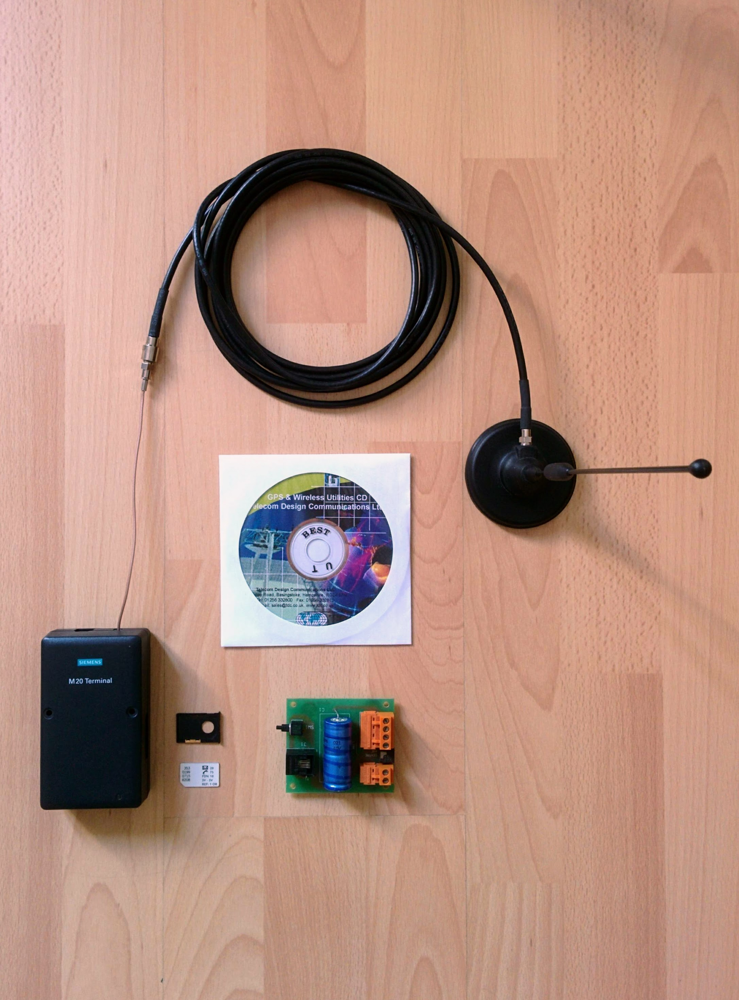

fon8
====

fon8 was a project that I worked on in the late 90s and involved requesting and sending [operator logos](https://en.wikipedia.org/wiki/Operator_logo) and ringtones via SMS.

At one stage, I had the domain fon8.com where you could view the available logos:

As you can see, each logo had a code to go with it, e.g. "L 30". You would then send an SMS to a given number, with this code as the message, and it would send you back an SMS that would update your phone's operator logo with the requested logo.

The device that received and sent the SMSs was a Siemens M20 terminal, it contained its own SIM card and looked like a normal mobile phone to the rest of the network. It was connected to a computer via a serial cable.

You can find the _M20 and M20T starter pack notes_ [here](m20-and-m20t-starter-pack.pdf).

And the relevant parts of the GSM spec [here](gsm-3.40-specs.pdf).

This project could handle both logos and ringtones but became bogged down during the development of software to _create_ new ringtones.

Some miscellaneous hand written notes are [here](notes.pdf). All the code related to this project is on a long lost harddrive somewhere.

Hardware
--------

Here you can see the hardware used:

A GSM suitable antenna, SIM card and tray, Siemens M20 terminal and power supply.

You can find more detailed photos [here](images).

I've no idea what is on the CD (and don't remember if it was even anything useful). 20 years later, it's no longer readable.

The M20 terminal has a rather odd power connection - it has two RJ11 sockets (one for audio - it could handle audio as well as SMSs) and one for power. I guess it was intended to be powered like a classic fixed line handset. Hence the PCB with the huge capicitors - it takes what looks like a 3.5x1.3mm barrel jack from a power adapter on one side and provides a powered RJ11 socket on the other.
