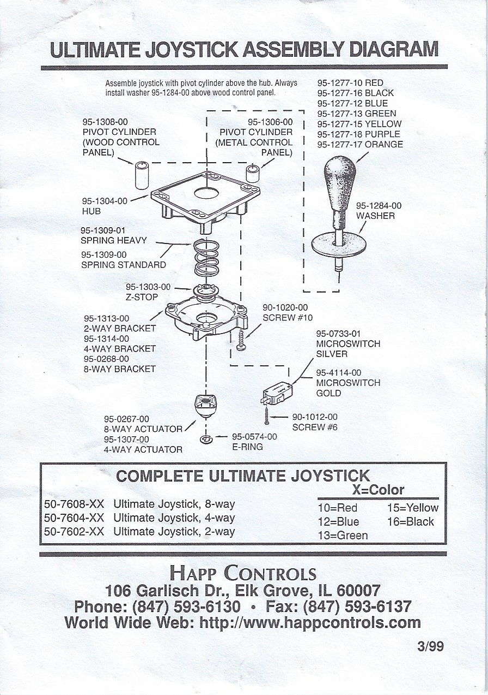
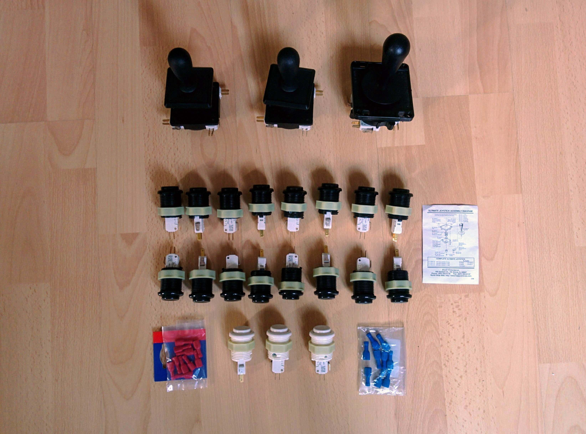
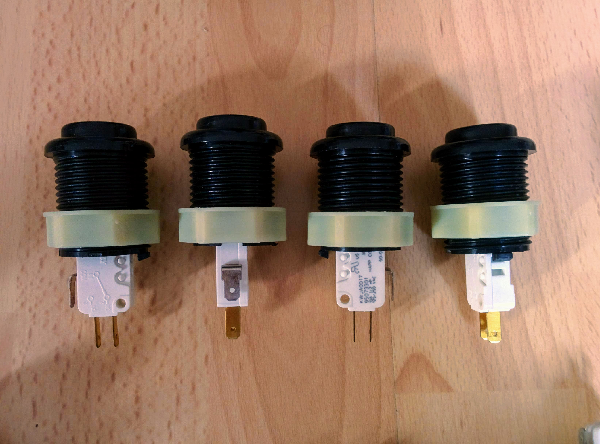
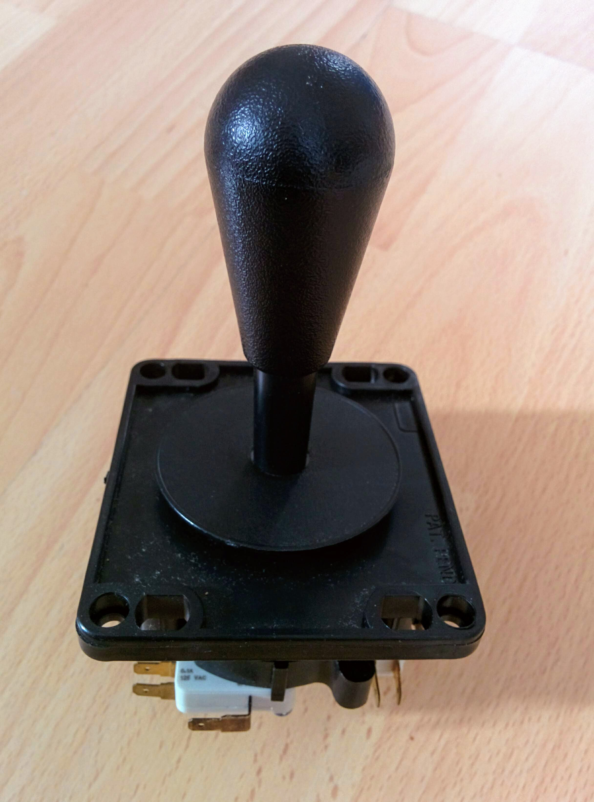
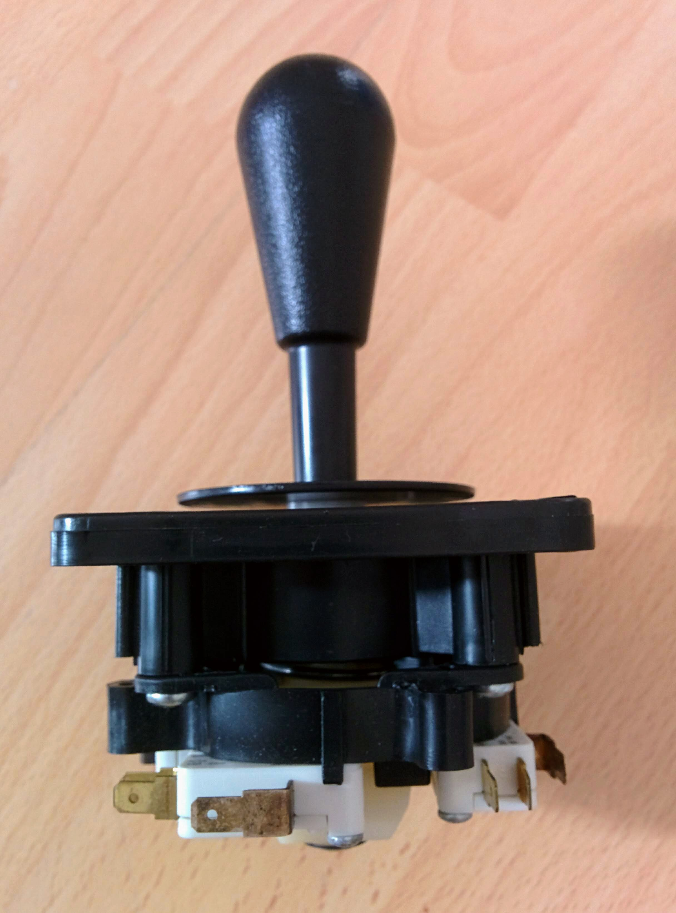
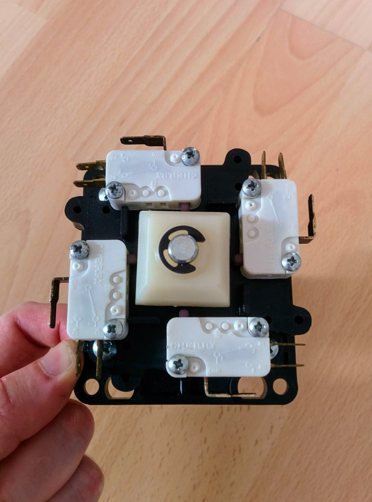
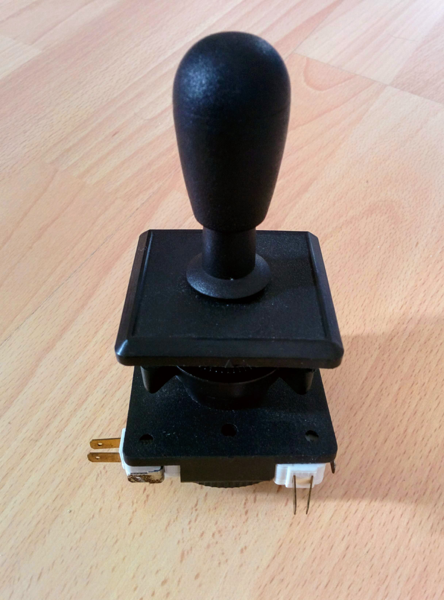
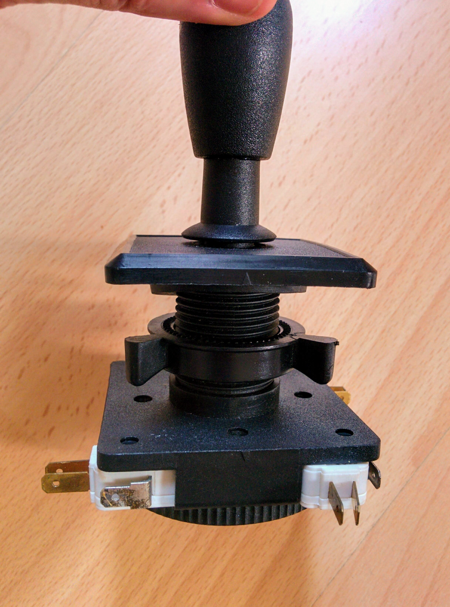
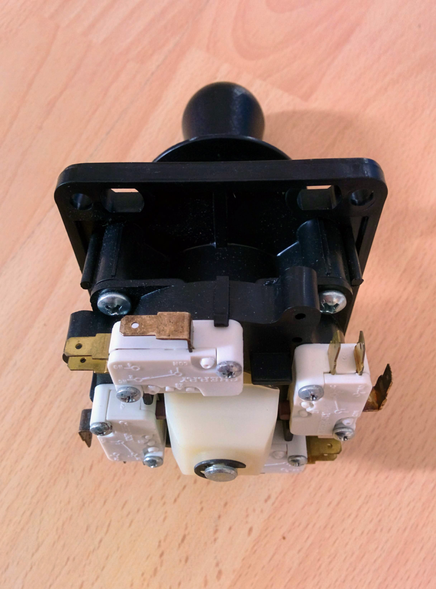
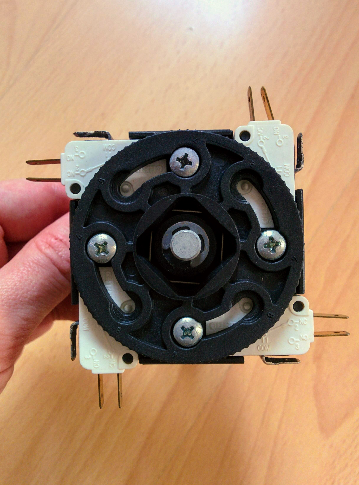

MAME arcade cabinet
===================

This was a project from the early 2000s to build a [MAME](https://en.wikipedia.org/wiki/MAME) arcade cabinet using genuine arcade parts from Happ Controls (now [SuzoHapp](https://en.wikipedia.org/wiki/SuzoHapp_North_America) since its take over of the Dutch company Suzo in 2005).

Back then, the nearest thing to the [GPIO header](https://www.raspberrypi.org/documentation/usage/gpio/) of the Raspberry Pi, in terms of an easily available set of pins that could be read by a PC, was the [parallel printer port](https://en.wikipedia.org/wiki/Parallel_port). The joysticks and buttons were wired up to pins of a parallel printer port so they could interact with MAME.

You can find pictures of the parts below.

Also included here are scans of _some_ of the pages of Happ Controls catalogs for [1999/2000](happ-catalog-1999-2000.pdf) and [2001](happ-catalog-2001.pdf), along with the [invoice](happ-europe-invoice.pdf) for the parts below.

The only instructions that came with the parts was this diagram showing how to assemble the larger of the two joystick varieties that I ordered:

Photos
------

